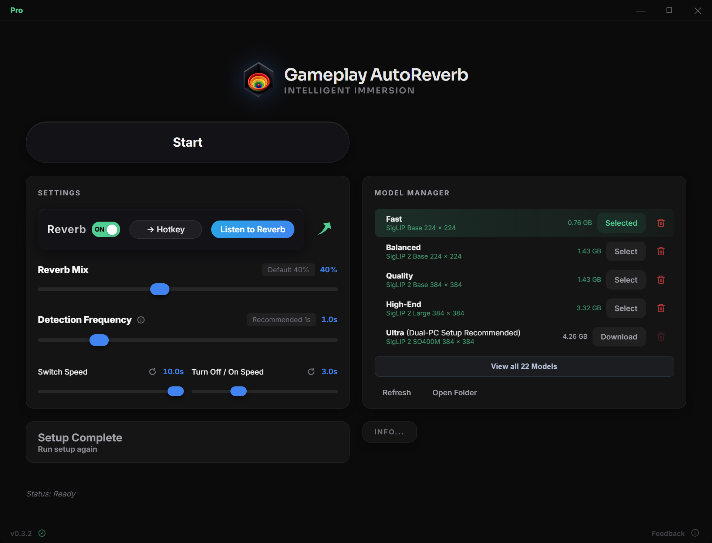

# Gameplay AutoReverb

### Sound like you are in-game.

**Voice Reverb changes Automatically with your Gameplay**

 

## Voice reverb that adapts to your game

Gameplay AutoReverb detects the in-game environment and automatically matches your microphone reverb to the scene.

- **Automatic scene matching** — Adapts reverb as you move between caves, cathedrals, forests, dungeons, and spaceship interiors.
- **Built for OBS** — Processes your microphone through the included VST3 effect, ready for streams and recordings.
- **Control when you need it** — Toggle reverb, preview the effect, set a hotkey, and adjust the mix from one panel.
- **100% local** — Scene detection and audio control run on your PC. No gameplay or microphone audio is uploaded.
