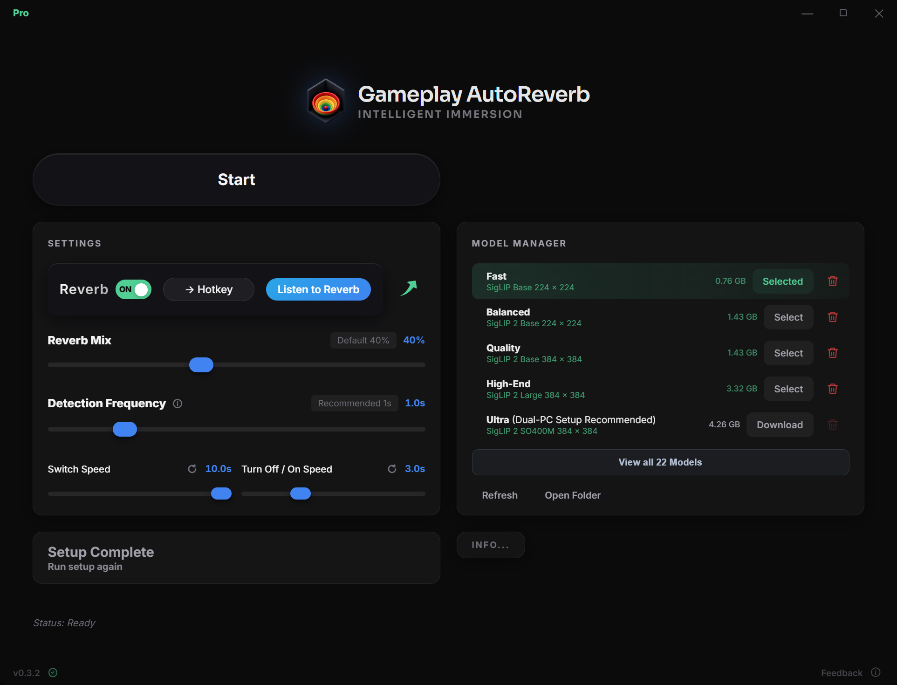
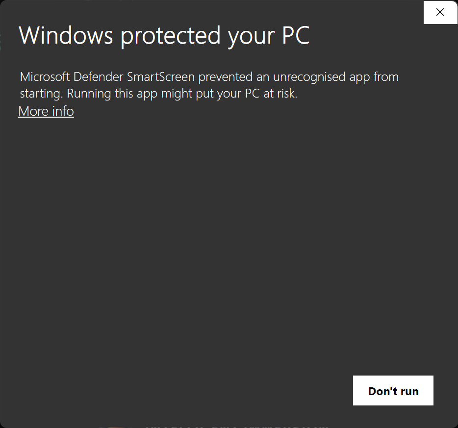
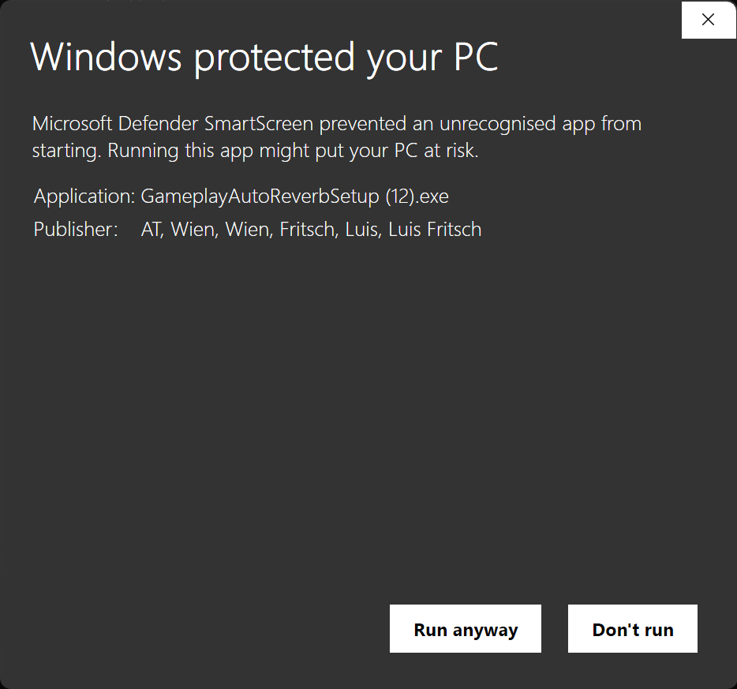

 

## How to install

> [!IMPORTANT]
> **Please read**
>
> Because the app is still new, Microsoft Defender SmartScreen may not recognize it yet and could display a warning. This is normal.  
> Gameplay AutoReverb is digitally signed in my name and safe to install.
>
> Thank you for giving Gameplay AutoReverb a try!
>
> \- Luis
>
> Click **More info**, then **Run anyway** to continue.
>
> **1. Click More info**
>
> 
>
> **2. Click Run anyway**
>
> 

## Voice reverb that adapts to your game

Gameplay AutoReverb detects the in-game environment and automatically matches your microphone reverb to the scene.

- **Automatic scene matching** — Adapts reverb as you move between caves, cathedrals, forests, dungeons, and spaceship interiors.
- **Built for OBS** — Processes your microphone through the included VST3 effect, ready for streams and recordings.
- **Control when you need it** — Toggle reverb, preview the effect, set a hotkey, and adjust the mix from one panel.
- **100% local** — Scene detection and audio control run on your PC. No gameplay or microphone audio is uploaded.

Visit the website for more information:

